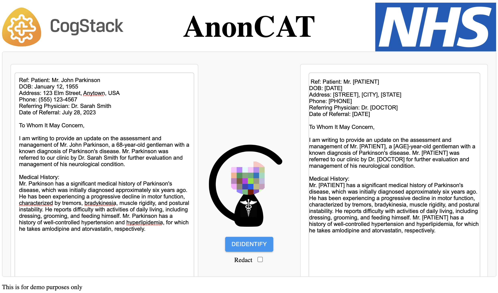

<p align="center">
  
</p>

# Deidentify app

The Deidentify app is a tool for redacting and replacing sensitive information in a document. It uses [MedCAT](https://github.com/CogStack/MedCAT), an advanced natural language processing tool, to identify and classify sensitive information, such as names, addresses, and medical terms.

## Example

<p align="center">
  
</p>

## Features
- Redact sensitive information: The Deidentify app can automatically redact sensitive information from a document, replacing it with a placeholder value, such as "[REDACTED]".
- Replace sensitive information: Alternatively, the app can replace sensitive information with a different value, such as a random name or address, to maintain the structure and context of the original document.
- Add customizable rules: The app allows users to create custom rules for identifying and classifying sensitive information based on their specific needs and use cases.
- Batch processing: The app can process multiple documents at once, making it easy to redact or replace sensitive information in large datasets.
  
## DeID Model
 *For out of the box models please contact: contact@cogstack.org*

- Step 1: Upload your model to the [models dir](anoncat/deidentify_app/models).

- Step 2: In the [settings.py](anoncat/api/settings.py) change the variable model_name to the file name of your model

### Build your own model

To build your own models please follow the tutorials outlined in [MedCATtutorials](https://github.com/CogStack/MedCATtutorials)

*__Note:__ This is currently under development*

## Starting the demo service

Start the Docker services by using `docker-compose`. This will build the necessary Docker images and start the services.
```bash
docker-compose up
```

Once the services are up and running, you can access the Deidentify app in your web browser by navigating to http://localhost:8000.

## Setup from source

- Install dependencies:
```bash
pip install -r requirements.txt
```

- Set up the database:
 ```bash
 python manage.py migrate
 ```

### Frontend Dependencies

This project uses frontend dependencies managed by npm. To install them, follow these steps:

1. Make sure you have [Node.js](https://nodejs.org/) and npm installed on your system.
2. Navigate to the project's [app directory](anoncat/deidentify_app). 
3. Run the following command to install the frontend dependencies:

   ```bash
   npm install
    ```
    ```bash
   npm run build
   ```

### Run the app:
```bash
python manage.py runserver 8000
```
